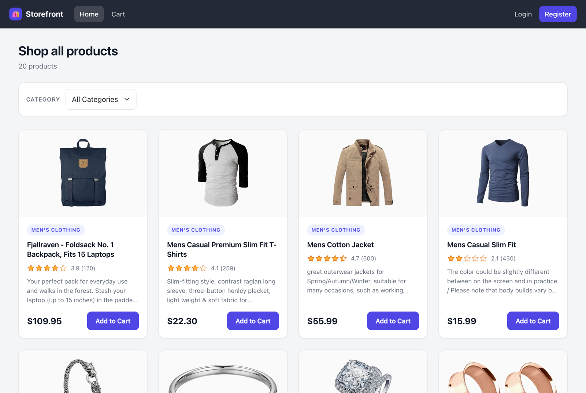

# E-Commerce App

A single-page e-commerce storefront built with React, TypeScript, and Vite. Products are pulled live from the [Fake Store API](https://fakestoreapi.com), the shopping cart is managed with Redux Toolkit, and Firebase provides user accounts, saved carts, and order history.

**Live demo:** https://ecommerce-seven-delta-83.vercel.app



## Table of Contents

- [Features](#features)
- [Tech Stack](#tech-stack)
- [Prerequisites](#prerequisites)
- [Getting Started](#getting-started)
- [Firebase Setup](#firebase-setup)
- [Available Scripts](#available-scripts)
- [Project Structure](#project-structure)
- [Routes](#routes)
- [Firestore Data Model](#firestore-data-model)
- [Deployment](#deployment)
- [Data Source](#data-source)

## Features

### Product Catalog

- Fetches all products from the API using React Query and displays them on the home page.
- Each product card shows title, price, category, description, star rating, and image.
- Images that fail to load (a known issue with some Fake Store API image URLs) automatically fall back to a placeholder so the layout never breaks.
- A category dropdown is populated dynamically from the API — nothing is hardcoded. Selecting a category re-queries the category-specific endpoint and shows only matching products.

### Accounts

- Email and password registration and sign-in through Firebase Authentication. The username entered at registration is saved as the account's display name.
- Auth state is shared app-wide through `AuthContext`, which also exposes an `authReady` flag so the rest of the app can tell "not signed in" apart from "not known yet" during the initial auth check.
- The navbar swaps between Login/Register and Profile/Logout depending on whether anyone is signed in.
- The profile page updates the display name, and can delete the account — which also removes that user's saved cart and every order they placed.

### Shopping Cart

- State is managed globally with Redux Toolkit (`cartSlice` + `configureStore`).
- Add a product to the cart directly from the home page listing.
- View, adjust quantity, or remove any item from the dedicated Cart page.
- Running total item count and total price update live as the cart changes.
- Cart contents persist in `sessionStorage` for everyone, so a guest's cart survives a page refresh.
- For signed-in users the cart is additionally saved to Firestore, so it follows them across browsers and devices. Writes are debounced so that holding down a quantity input doesn't generate a write per keystroke.
- Signing in **merges** a guest cart with the saved one rather than picking a winner: items are matched on product id and the larger of the two quantities is kept, so nothing the user added is silently dropped.
- Signing out clears the local cart so the next person to use the browser doesn't inherit it.

### Orders

- Checkout requires an account; signed-out users are sent to the login page.
- Placing an order writes it to Firestore with a server-assigned timestamp, and only clears the cart once that write succeeds — a failed order never costs the user their cart.
- The profile page lists past orders newest-first with date, item count, and total.

## Tech Stack

| Category         | Library                                |
| ---------------- | -------------------------------------- |
| UI               | React 19, Bootstrap 5, custom CSS      |
| Language         | TypeScript                             |
| Build tool       | Vite                                   |
| Auth & database  | Firebase Authentication, Cloud Firestore |
| Data fetching    | TanStack React Query, Axios            |
| State management | Redux Toolkit, React Redux             |
| Routing          | React Router                           |
| Ratings widget   | @smastrom/react-rating                 |

## Prerequisites

- [Node.js](https://nodejs.org/) 18 or later
- npm (comes bundled with Node.js)
- A [Firebase](https://console.firebase.google.com/) project, if you want to run this against your own backend rather than the one already configured

## Getting Started

1. Clone the repository and move into the project folder:

   ```bash
   git clone <repository-url>
   cd ecommerce
   ```

2. Install dependencies:

   ```bash
   npm install
   ```

3. Start the development server:

   ```bash
   npm run dev
   ```

4. Open the URL Vite prints in the terminal (typically [http://localhost:5173](http://localhost:5173)) in your browser.

Product data comes from the public Fake Store API and needs no key. The Firebase config is checked into `src/lib/firebase/firebase.ts` and points at an existing demo project, so the app runs as-is — see below to point it at your own.

## Firebase Setup

To run against your own Firebase project:

1. Replace the `firebaseConfig` object in `src/lib/firebase/firebase.ts` with the config from your project (Project settings → Your apps → Web app).
2. Under **Authentication → Sign-in method**, enable **Email/Password**.
3. Create a **Cloud Firestore** database.
4. Publish the security rules in [`firestore.rules`](firestore.rules) (Firestore → Rules). They restrict every document to the user who owns it and make orders immutable once placed. Do not leave the database in test mode — those rules allow the whole world to read every order, and they expire after 30 days.
5. Create the composite index described in [`firestore.indexes.json`](firestore.indexes.json): collection `orders`, `userId` ascending then `createdAt` descending. The order history query needs it, and Firestore will not create it automatically. If you skip this step the profile page reports the failure and links straight to the console page that creates it.

Steps 4 and 5 can be done from the Firebase console by hand. If you prefer, installing the [Firebase CLI](https://firebase.google.com/docs/cli) and running `firebase init firestore` lets you deploy both files with `firebase deploy --only firestore` instead.

Note that a Firebase web API key is a public project identifier rather than a secret — it ships in the client bundle by design. The security rules, not the key, are what protect the data.

## Available Scripts

| Command           | Description                                             |
| ----------------- | ------------------------------------------------------- |
| `npm run dev`     | Starts the Vite dev server with hot module reload.      |
| `npm run build`   | Type-checks the project and builds it for production.   |
| `npm run preview` | Serves the production build locally to sanity-check it. |
| `npm run lint`    | Runs ESLint across the codebase.                        |

## Project Structure

```
src/
├── api/               # Axios client and Fake Store API request functions
├── app/               # Redux store configuration and sessionStorage persistence
├── components/        # ProductCard, Cart, Navbar and other UI components
├── context/           # React Context for auth state and product/category state
├── features/cart/     # Cart slice, Firestore sync hook, and its mount component
├── lib/firebase/      # Firebase initialization, auth helpers, Firestore queries
├── pages/             # Route-level pages (Home, Profile, Login, Register, Logout)
├── styles/            # Shared inline style objects for the auth forms
└── types/             # Shared TypeScript types
```

## Routes

| Path        | Page                                                          |
| ----------- | ------------------------------------------------------------- |
| `/`         | Home — product catalog, category filter, add to cart          |
| `/cart`     | Shopping cart — view, edit, remove items, checkout            |
| `/profile`  | Profile — update display name, view order history, delete account |
| `/login`    | Sign in with email and password                                |
| `/register` | Create an account                                              |
| `/logout`   | Signs the current user out                                     |

## Firestore Data Model

| Collection | Document ID     | Fields                                                        |
| ---------- | --------------- | ------------------------------------------------------------- |
| `orders`   | auto-generated  | `userId`, `items`, `totalItems`, `totalPrice`, `createdAt`     |
| `carts`    | the user's UID  | `items`, `updatedAt`                                           |

Each user has at most one cart document, keyed by their UID, and any number of order documents tagged with their `userId`. All Firestore reads and writes live in `src/lib/firebase/firestore.ts` so that components never talk to the SDK directly.

## Deployment

The app is a static Vite build, so it deploys to Vercel or Netlify with no server. `vercel.json` and `netlify.toml` are included and already rewrite all paths to `index.html`, so `/cart` and `/profile` survive a direct visit or a refresh instead of returning a 404.

- Build command: `npm run build`
- Publish directory: `dist`

Firestore rules and indexes are not part of the static build — deploy those to Firebase separately, as described under [Firebase Setup](#firebase-setup). Remember to add your deployed domain under Authentication → Settings → Authorized domains, or sign-in will fail in production.

## Data Source

All product and category data comes from the [Fake Store API](https://fakestoreapi.com):

- `GET /products` — all products
- `GET /products/categories` — list of available categories
- `GET /products/category/{category}` — products in a specific category

The Fake Store API is a free testing API and does not process real orders. Checkout records a real order document in Firestore, but no payment is taken and nothing ships.
